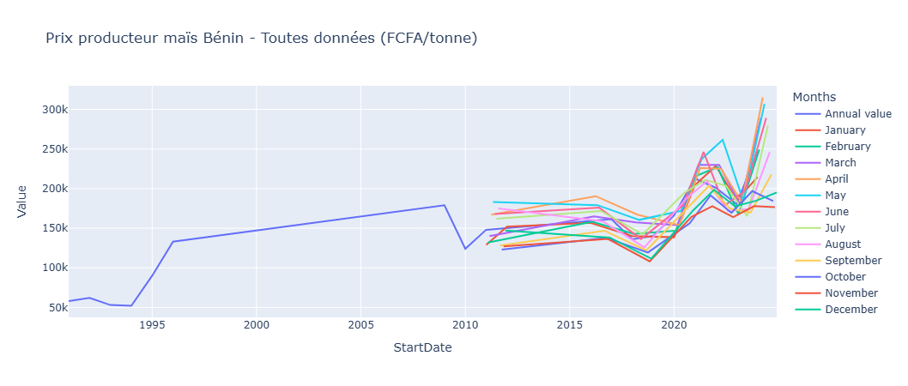

# Prédiction des Prix du Maïs au Bénin 🇧🇯🌽

**Prévisions mensuelles intelligentes des prix du maïs à la production**  
Un projet Data Science qui combine time series forecasting, Prophet et déploiement web pour aider agriculteurs, commerçants et décideurs à anticiper la volatilité des prix.

  

## 🎯 Pourquoi ce projet ?

Au Bénin, le maïs représente une part essentielle de l'alimentation et de l'économie agricole (~25-30 % des cultures vivrières).  
Les prix fluctuent fortement selon les saisons, la pluviométrie, l'inflation, les coûts d'intrants et la demande régionale (notamment vers le Nigeria).

**Objectif** :  
Construire un modèle fiable qui prédit les prix mensuels à 12–24 mois, avec une erreur moyenne de seulement **10.6 %** (MAPE).

## ✨ Résultats clés

- **MAPE** : 10.6 % (erreur relative moyenne)  
- **MAE** : 19 201 FCFA/tonne  
- **Saisonnalité captée** : pics mars–juin (soudure), creux sept–nov (post-récolte)  
- **Prévision 2026** : pic attendu ~282 000 FCFA/tonne en mai, creux ~201 000 en novembre

## Aperçu des prévisions 2026

| Mois       | Prévision centrale (FCFA/tonne) | Borne basse | Borne haute |
|------------|----------------------------------|-------------|-------------|
| Janvier    | 239 250                         | 209 556    | 269 832    |
| Février    | 247 954                         | 215 154    | 279 960    |
| Mars       | 257 215                         | 224 239    | 289 298    |
| Avril      | 268 110                         | 235 926    | 296 888    |
| **Mai**    | **282 663**                     | 253 562    | 315 508    |
| Juin       | 271 222                         | 240 069    | 315 508    |
| Juillet    | 259 843                         | 228 825    | 292 235    |
| Août       | 253 378                         | 220 805    | 286 688    |
| Septembre  | 230 987                         | 198 790    | 262 391    |
| Octobre    | 228 895                         | 198 670    | 262 231    |
| Novembre   | **201 423**                     | 170 158    | 231 407    |
| Décembre   | 217 206                         | 183 415    | 248 309    |

## Technologies utilisées

- **Data** : FAO Producer Prices (Bénin) – données mensuelles & annuelles
- **Traitement** : pandas, numpy
- **Visualisation** : Plotly, matplotlib
- **Modélisation** : Facebook Prophet (avec saisonnalité personnalisée semestrielle)
- **Déploiement futur** : Streamlit (dashboard interactif en cours)
- **Environnement** : Python 3.10+, VS Code + Jupyter

## Structure du repository
prix-mais-benin/
├── data/
│   └── raw/                  # CSV FAO originaux
├── notebooks/
│   └── 01_EDA_et_Model.ipynb # Nettoyage, EDA, Prophet
├── src/
│   └── data_prep.py          # Fonctions de nettoyage
├── app.py                    # Dashboard Streamlit (à venir)
├── requirements.txt
├── README.md
└── .gitignore